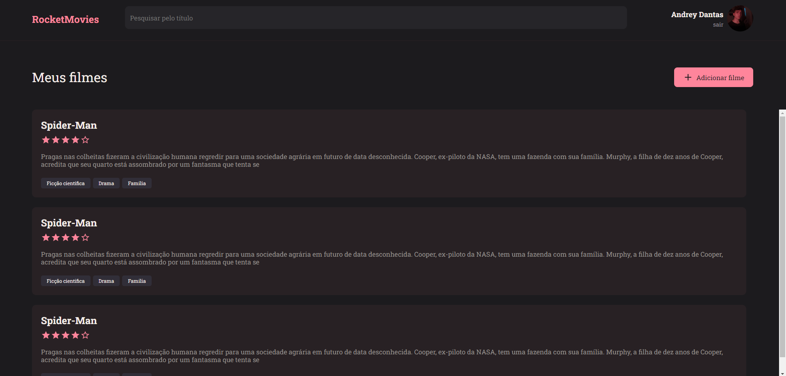

<h1 align="center">RocketMovies</h1>

## 🔖Preview
<p >
	  
	</p>
 
  
## 📜 Sobre
<p>
Aplicação para salvar seus filmes favoritos com sua descição, tags e nota de aprovação.
</p>
<p>
	Aplicação feita seguindo as instruções do projeto Explorer da Rocketseat, feito com ReactJs, styled components, entre outras tecnologias.
</p>

## 🚀 Tecnologias
- ReactJs
- Styled Components
- Material Ui
- ViteJs
- Nodejs
- Express
- SQLite
- Knex
- Bcrypt
- JsonWebToken
- Multer

## 💻 Iniciando o Projeto


### Requisitos

**Clone o Projeto e acesse o Diretório**

```bash
$ git clone https://github.com/andreydantasvf/RocketMovies && cd RocketMovies 
```

**Para iniciar o server da aplicação:**
```bash
$ cd server && npm install
```
```bash
$ npm run dev
```

**Para iniciar a aplicação web:**
```bash
$ cd web && npm install
```
```bash
$ npm run dev
```

---
Feito por Andrey Dantas 👋 Siga minhas redes sociais:
- [Instagram](https://www.instagram.com/andreydantasvf/)
- [Twitter](https://twitter.com/andreydantasvf)
- [Linkedin](https://www.linkedin.com/in/andreydantasvf/)